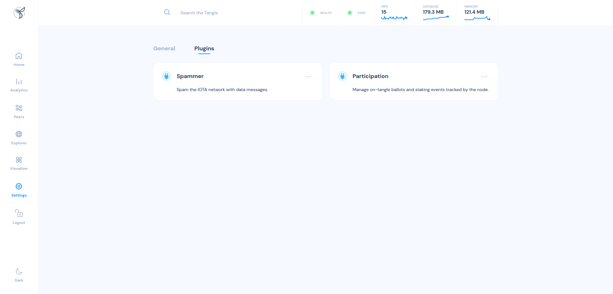
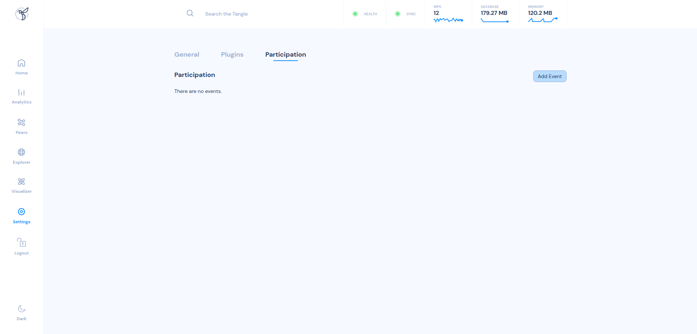
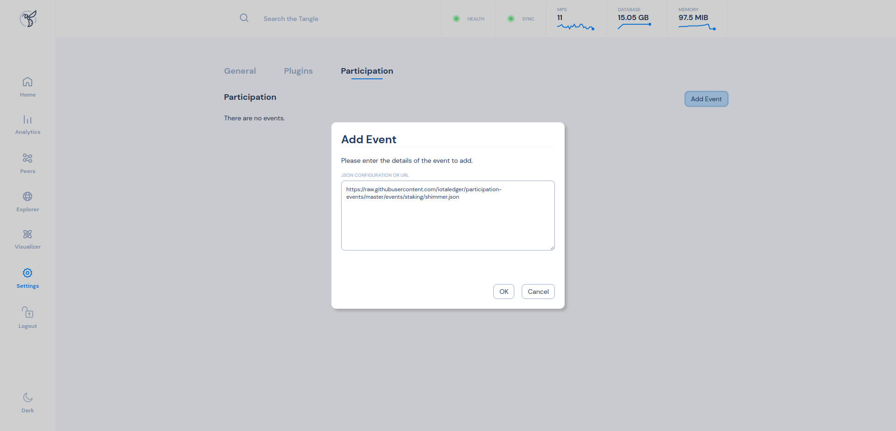
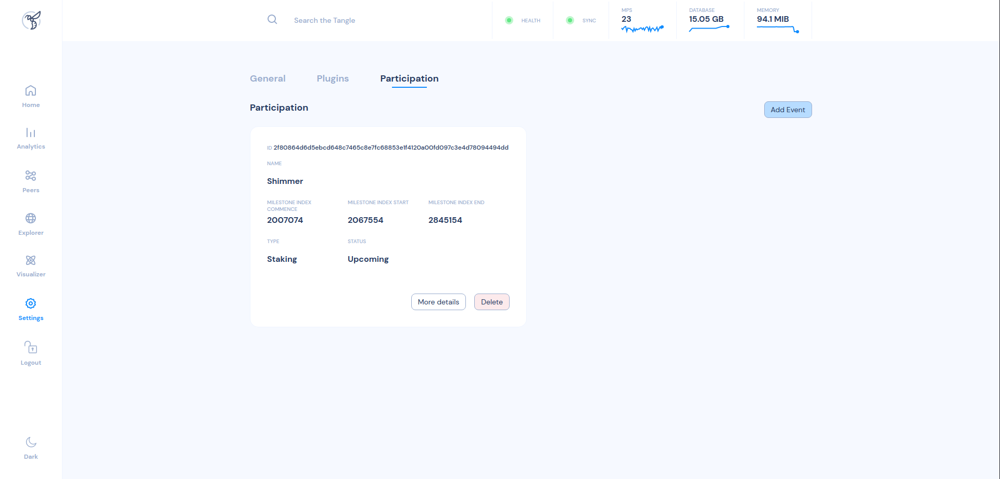
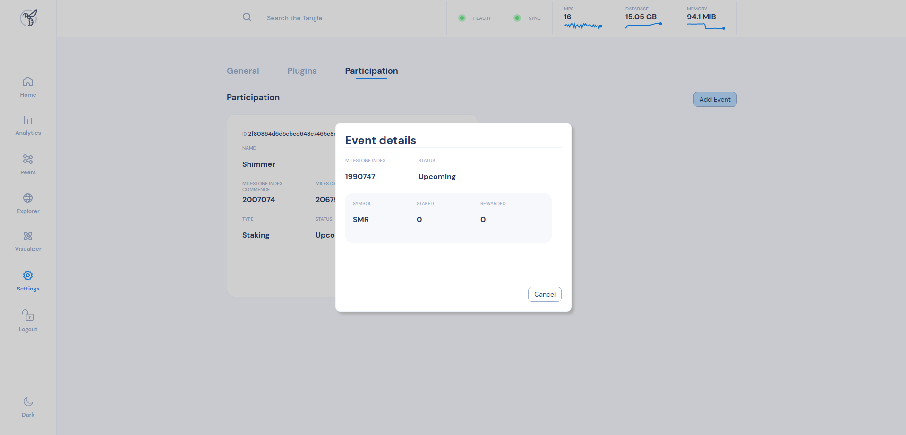

# Shimmer Governance Participation Events

This repository contains the configurations for participation events of official governance votes in the Shimmer network.

## Current Event `raw`-links

### [SGP - 0001] Shimmer Community Grant Committee - Lead selection

Link: https://raw.githubusercontent.com/iota-community/Shimmer-governance-participation-events/SGP-0001---SGP-0005/events/vote/%5BSGP%20-%200001%5D%20Shimmer%20Community%20Grant%20Committee%20-%20Lead%20selection.json

ID: `0x8f757e3d09323ebf0629a8f2e4ab4dc8b9d2c628b97af00a82bd97a936335302`

### [SGP - 0002] Shimmer Community Grant Committee Grant Reviewer selection

Link: https://raw.githubusercontent.com/iota-community/Shimmer-governance-participation-events/SGP-0001---SGP-0005/events/vote/%5BSGP%20-%200002%5D%20Shimmer%20Community%20Grant%20Committee%20Grant%20Reviewer%20selection.json

ID: `0x38ad55a25b0b6dc6694f38c7c60abc6b48f8b39d070204c4c24512b262677bac`

### [SGP - 0003] Shimmer Growth Committee as part of the Tangle Ecosystem Association

Link: https://raw.githubusercontent.com/iota-community/Shimmer-governance-participation-events/SGP-0001---SGP-0005/events/vote/%5BSGP%20-%200003%5D%20Shimmer%20Growth%20Committee%20as%20part%20of%20the%20Tangle%20Ecosystem%20Association.json

ID: `0x66fd0a5be96d78918a55bcabc08a255d8ba63977b641c2ff1aef1cdd79ddfef4`

### [SGP - 0005] Shimmer Community Treasury Grant Committee

Link: https://raw.githubusercontent.com/iota-community/Shimmer-governance-participation-events/SGP-0001---SGP-0005/events/vote/%5BSGP%20-%200005%5D%20-%20Shimmer%20Community%20Treasury%20Grant%20Committee.json

ID: `0x1676eef80c31f2beaa561d349293c4386087c477eb3e4d818ae9fe119723f657`

## How to add a ballot or staking event as a node operator?

### Add event via node dashboard

After starting your node, you can open the node dashboard and navigate to `Settings` -> `Plugins`. 
If the Participation plugin has been successfully enabled, you should see a new option called `Participation`.

Click on the three dots next to `Participation` to enter the plugin settings.

In the top right corner, click `Add Event`. 
Now you can paste the `raw`-link to the event configuration file.

After clicking `OK`, the new event is shown (if everything was entered correctly).

Your node is now ready to track the specific participation event. You can view the current status of the event by clicking on `More details`.

## Previous Events

### Shimmer Ecosystem Funding Proposal

Link: https://raw.githubusercontent.com/iotaledger/participation-events/master/events/vote/shimmer_funding.json 
ID: `9e8e1a15c831441797912a86022f5a78fcb70e151e43fe84812d4c7f6eb79a7b`
